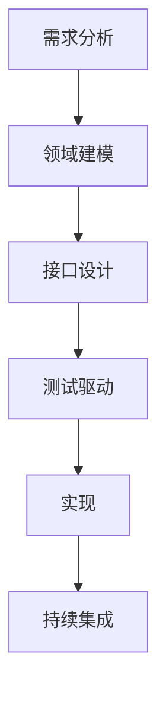

# 证书管理系统开发问题综合总结

## 1. 编译与构建问题

### 1.1 Maven编译配置问题

**问题现象**：

- 编译失败，错误信息显示"无效的标记: --release"
- Maven编译器插件版本与Java 17不兼容

**解决方案**：

```xml
<build>
  <plugins>
    <plugin>
      <groupId>org.apache.maven.plugins</groupId>
      <artifactId>maven-compiler-plugin</artifactId>
      <version>3.11.0</version>
      <configuration>
        <source>17</source>
        <target>17</target>
      </configuration>
    </plugin>
  </plugins>
</build>
```

### 1.2 MySQL驱动配置问题

**问题现象**：

- 测试报错"Failed to determine a suitable driver class"

**解决方案**：
更新pom.xml依赖：

```xml
<dependency>
    <groupId>com.mysql</groupId>
    <artifactId>mysql-connector-j</artifactId>
    <version>8.0.33</version>
    <scope>runtime</scope>
</dependency>
```

## 2. 领域模型与测试问题

### 2.1 模型与测试类不匹配

**问题现象**：

- CertificateContent构造器参数不匹配
- 测试类调用getId()但DomainName是值对象无id字段
- Optional API使用不一致(isEmpty vs isPresent)

**解决方案**：

1. 统一测试类与模型类构造器参数
2. 修改DomainName测试类，使用值对象本身作为标识：

```java
// 原错误用法
domainName.getId();

// 正确用法
domainName.value();
```

### 2.2 数据库初始化问题

**问题现象**：

- schema.sql中的索引长度超过MySQL限制(3072字节)

**解决方案**：

1. 修改schema.sql：
    - 将VARCHAR(2048)改为TEXT类型
    - 添加前缀索引`UNIQUE KEY idx_public_key (public_key(255))`

## 3. 持久层实现问题

### 3.1 Repository接口设计

**问题现象**：

- findById/deleteById方法与领域概念不符
- 证书查询应基于公钥而非通用ID

**解决方案**：

```java
public interface CertificateRepository {
    Optional<CertificateContent> findByPublicKey(String publicKey);
    void deleteByPublicKey(String publicKey);
    // ...
}
```

### 3.2 MyBatis映射问题

**问题现象**：

- Mapper方法名与Repository接口不匹配
- save方法返回类型不一致

**解决方案**：

```java
public interface CertificateMapper {
    CertificateContent findByPublicKey(String publicKey);
    int deleteByPublicKey(String publicKey);
    CertificateContent save(CertificateContent content);
}
```

## 4. 系统改进方案

### 4.1 立即解决方案

- 修复编译错误
- 统一接口定义
- 同步测试用例

### 4.2 长期改进措施

1. 建立代码评审checklist
2. 引入架构守护工具(ArchUnit)
3. 完善持续集成流水线

### 4.3 最佳实践总结



## 5. 经验总结

1. **环境兼容性**：

    - 开发前确认操作系统特性差异
    - 使用跨平台兼容的命令或脚本

2. **依赖管理**：

    - 定期检查依赖库的官方文档
    - 使用最新稳定版本的依赖

3. **数据库设计**：

    - 了解不同数据库引擎的索引限制
    - 对于大文本字段，考虑使用前缀索引

4. **测试实践**：

    - 确保测试资源配置完整
    - 在CI/CD流程中加入环境验证步骤

5. **文档规范**：
    - 记录开发过程中的典型问题
    - 维护项目配置说明文档
    - 记录环境要求和依赖版本
