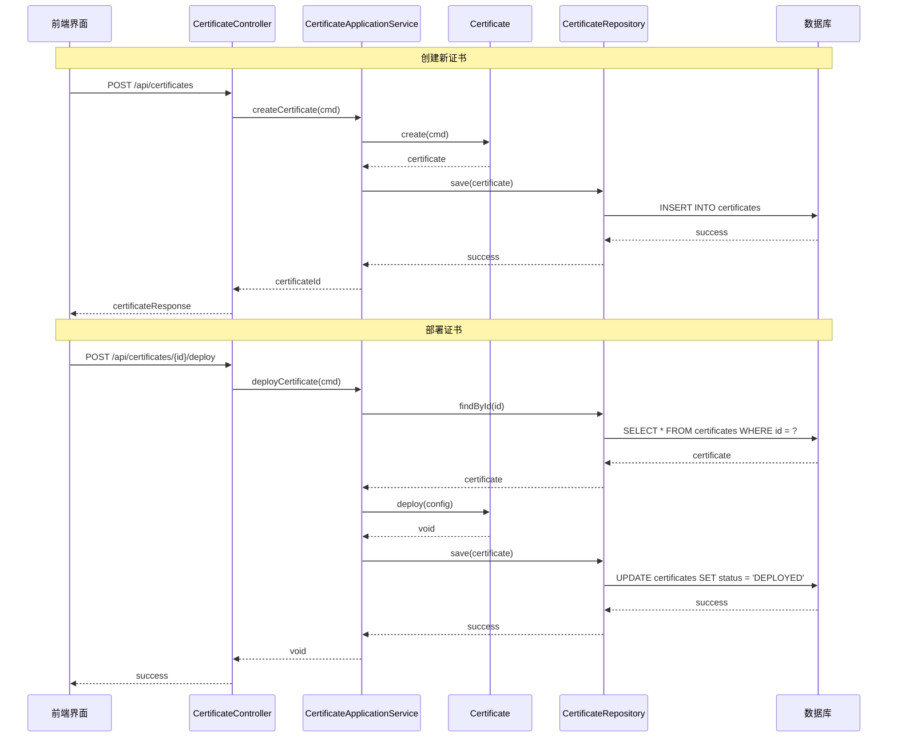

# 限界上下文战术设计 - 证书管理上下文 (Certificate Context)

## **1. 上下文概述与通用语言 (Context Overview & Ubiquitous Language)**

### **1.1 战略承接 (Strategic Alignment)**

- **承载的子域**: 核心域：证书生命周期管理
- **子域类型**: 核心域
- **核心战略职责**:

    > 负责证书的完整生命周期管理，包括创建、更新、部署、撤销等核心操作，确保系统间通信的安全性和可信度。

- **上下文边界 (Context Boundary)**:
    > 本上下文**不负责**以下业务：
    >
    > - 域名的基础信息管理（由域名上下文负责）
    > - 用户身份认证与权限管理（由认证授权上下文负责）
    > - 操作日志的存储和查询（由审计日志上下文负责）

### **1.2 通用语言 (Ubiquitous Language)**

| 术语 (Term)            | 在本上下文中的精确定义                                       | 备注/反模式警告                                             |
| :--------------------- | :----------------------------------------------------------- | :---------------------------------------------------------- |
| **证书 (Certificate)** | 包含公钥、私钥、域名信息的数字证书，是确保通信安全的核心凭证 | **警告**: 避免在`Certificate`中包含与证书本身无关的业务逻辑 |
| **部署 (Deployment)**  | 将证书应用到指定系统的过程，包括上架和下架操作               | 这是证书从管理态到运行态的转换过程                          |
| **证书状态 (Status)**  | 证书在其生命周期中的当前状态，如未上架、已上架、已过期等     | 状态变更需要触发相应的领域事件                              |

## **2. 需求映射：从用户故事到用例 (Requirement Mapping: User Stories to Use Cases)**

| 用户故事ID | 故事标题           | 关联的应用层操作                                              | 触发的主要领域事件      |
| :--------- | :----------------- | :------------------------------------------------------------ | :---------------------- |
| `CERT-002` | 开发人员上传新证书 | **用例**: `CertificateApplicationService.createCertificate`   | `CertificateCreated`    |
| `CERT-002` | 开发人员上架证书   | **用例**: `CertificateApplicationService.deployCertificate`   | `CertificateDeployed`   |
| `CERT-003` | 运维人员下架证书   | **用例**: `CertificateApplicationService.undeployCertificate` | `CertificateUndeployed` |
| `CERT-004` | 外部系统查询证书   | **查询**: `CertificateQueryService.getCertificatesByDomain`   | (无)                    |

## **3. 全局技术规约 (Global Technical Specifications)**

### **3.1 错误处理规约**:

```java
public class CertificateException extends RuntimeException {
    private final ErrorCode errorCode;

    public enum ErrorCode {
        CERTIFICATE_NOT_FOUND,
        INVALID_CERTIFICATE_STATUS,
        VALIDATION_FAILED,
        DEPLOYMENT_FAILED,
        SYSTEM_ERROR
    }
}
```

### **3.2 代码组织结构约定**

```
certificate/
├── application/
│   ├── command/
│   │   ├── CreateCertificateCommand.java
│   │   ├── DeployCertificateCommand.java
│   │   └── UndeployCertificateCommand.java
│   ├── query/
│   │   ├── GetCertificateDetailsQuery.java
│   │   └── ListCertificatesQuery.java
│   └── service/
│       └── CertificateApplicationService.java
├── domain/
│   ├── model/
│   │   ├── certificate/
│   │   │   ├── Certificate.java
│   │   │   ├── CertificateId.java
│   │   │   ├── CertificateStatus.java
│   │   │   └── CertificateContent.java
│   │   └── deployment/
│   │       ├── Deployment.java
│   │       └── DeploymentConfig.java
│   ├── repository/
│   │   └── CertificateRepository.java
│   └── service/
│       └── CertificateService.java
└── infrastructure/
    ├── persistence/
    │   ├── mapper/
    │   │   └── CertificateMapper.java
    │   ├── MybatisCertificateRepository.java
    │   └── entity/
    └── external/
        └── vault/
```

## **4. 领域层设计 (Domain Layer Design)**

### **4.1 聚合: `证书 (Certificate)`**

```java
@Aggregate
public class Certificate {
    @AggregateId
    private CertificateId id;
    private String name;
    private CertificateContent content;
    private CertificateStatus status;
    private DomainId domainId;
    private LocalDateTime validFrom;
    private LocalDateTime validTo;
    private LocalDateTime createdAt;
    private List<Deployment> deployments;

    // 工厂方法
    public static Certificate create(CreateCertificateCommand cmd) {
        validateCertificateContent(cmd.getContent());
        Certificate cert = new Certificate();
        cert.id = CertificateId.generate();
        cert.content = cmd.getContent();
        cert.status = CertificateStatus.PENDING;
        cert.validFrom = cmd.getValidFrom();
        cert.validTo = cmd.getValidTo();
        cert.createdAt = LocalDateTime.now();

        // 发布事件
        cert.registerEvent(new CertificateCreatedEvent(cert.id));
        return cert;
    }

    // 部署证书
    public void deploy(DeploymentConfig config) {
        validateDeploymentEligibility();
        Deployment deployment = Deployment.create(config);
        this.deployments.add(deployment);
        this.status = CertificateStatus.DEPLOYED;

        // 发布事件
        this.registerEvent(new CertificateDeployedEvent(this.id));
    }

    // 下架证书
    public void undeploy() {
        validateUndeploymentEligibility();
        this.status = CertificateStatus.UNDEPLOYED;

        // 发布事件
        this.registerEvent(new CertificateUndeployedEvent(this.id));
    }

    // 验证方法
    private void validateDeploymentEligibility() {
        if (this.status == CertificateStatus.DEPLOYED) {
            throw new CertificateException(ErrorCode.INVALID_CERTIFICATE_STATUS);
        }
        if (LocalDateTime.now().isAfter(this.validTo)) {
            throw new CertificateException(ErrorCode.VALIDATION_FAILED);
        }
    }
}
```

#### **4.1.1 值对象: `CertificateContent`**

```java
@Value
public class CertificateContent {
    private final String publicKey;
    private final String privateKey;
    private final String certificateChain;
    private final String format;  // 如 "PEM", "DER"

    public CertificateContent(String publicKey, String privateKey,
                            String certificateChain, String format) {
        validateKeys(publicKey, privateKey);
        validateChain(certificateChain);
        validateFormat(format);

        this.publicKey = publicKey;
        this.privateKey = privateKey;
        this.certificateChain = certificateChain;
        this.format = format;
    }
}
```

#### **4.1.2 实体: `Deployment`**

```java
@Entity
public class Deployment {
    private DeploymentId id;
    private DeploymentConfig config;
    private DeploymentStatus status;
    private LocalDateTime deployedAt;

    public static Deployment create(DeploymentConfig config) {
        Deployment deployment = new Deployment();
        deployment.id = DeploymentId.generate();
        deployment.config = config;
        deployment.status = DeploymentStatus.ACTIVE;
        deployment.deployedAt = LocalDateTime.now();
        return deployment;
    }
}
```

## **5. 应用层设计 (Application Layer Design)**

### **5.1 应用服务: `CertificateApplicationService`**

```java
@ApplicationService
public class CertificateApplicationService {
    private final CertificateRepository certificateRepository;
    private final DomainContext domainContext;
    private final EventPublisher eventPublisher;

    @Transactional
    public CertificateId createCertificate(CreateCertificateCommand cmd) {
        // 验证域名存在性
        domainContext.validateDomainExists(cmd.getDomainId());

        // 创建证书
        Certificate certificate = Certificate.create(cmd);

        // 保存并发布事件
        certificateRepository.save(certificate);
        eventPublisher.publish(certificate.getDomainEvents());

        return certificate.getId();
    }

    @Transactional
    public void deployCertificate(DeployCertificateCommand cmd) {
        Certificate certificate = certificateRepository.findById(cmd.getCertificateId())
            .orElseThrow(() -> new CertificateException(ErrorCode.CERTIFICATE_NOT_FOUND));

        certificate.deploy(cmd.getDeploymentConfig());

        certificateRepository.save(certificate);
        eventPublisher.publish(certificate.getDomainEvents());
    }
}
```

### **5.2 查询服务: `CertificateQueryService`**

```java
@QueryService
public class CertificateQueryService {
    private final CertificateDAO certificateDAO;

    public CertificateDetailsDTO getCertificateDetails(GetCertificateDetailsQuery query) {
        return certificateDAO.findDetailsByCertificateId(query.getCertificateId())
            .orElseThrow(() -> new CertificateException(ErrorCode.CERTIFICATE_NOT_FOUND));
    }

    public List<CertificateDTO> getCertificatesByDomain(GetCertificatesByDomainQuery query) {
        return certificateDAO.findByDomainId(query.getDomainId());
    }
}
```

## **6. 基础设施层设计 (Infrastructure Layer Design)**

### **6.1 仓储实现: `MybatisCertificateRepository`**

```java
@Repository
public class MybatisCertificateRepository implements CertificateRepository {
    @Autowired
    private CertificateMapper certificateMapper;

    @Override
    public void save(Certificate certificate) {
        if (certificate.isNew()) {
            certificateMapper.insert(certificate);
        } else {
            certificateMapper.update(certificate);
        }
    }

    @Override
    public Optional<Certificate> findById(CertificateId id) {
        return Optional.ofNullable(certificateMapper.findById(id.getValue()));
    }
}
```

### **6.1.1 Mapper接口: `CertificateMapper`**

```java
@Mapper
public interface CertificateMapper {
    @Insert("""
        INSERT INTO certificates (
            id, name, content, status, domain_id,
            valid_from, valid_to, created_at
        ) VALUES (
            #{id}, #{name}, #{content}, #{status}, #{domainId},
            #{validFrom}, #{validTo}, #{createdAt}
        )
    """)
    void insert(Certificate certificate);

    @Update("""
        UPDATE certificates SET
            name = #{name},
            content = #{content},
            status = #{status},
            domain_id = #{domainId},
            valid_from = #{validFrom},
            valid_to = #{validTo}
        WHERE id = #{id}
    """)
    void update(Certificate certificate);

    @Select("""
        SELECT
            c.id, c.name, c.content, c.status, c.domain_id,
            c.valid_from, c.valid_to, c.created_at,
            d.id as deployment_id, d.config, d.status as deployment_status,
            d.deployed_at
        FROM certificates c
        LEFT JOIN deployments d ON c.id = d.certificate_id
        WHERE c.id = #{id}
    """)
    @Results({
        @Result(property = "id", column = "id"),
        @Result(property = "deployments", column = "id",
                many = @Many(select = "findDeploymentsByCertificateId"))
    })
    Certificate findById(String id);

    @Select("""
        SELECT
            id, config, status, deployed_at
        FROM deployments
        WHERE certificate_id = #{certificateId}
    """)
    List<Deployment> findDeploymentsByCertificateId(String certificateId);

    @Select("""
        SELECT
            c.id, c.name, c.status, c.valid_from, c.valid_to
        FROM certificates c
        WHERE c.domain_id = #{domainId}
    """)
    List<CertificateDTO> findByDomainId(String domainId);

    @Select("""
        SELECT
            c.id, c.name, c.content, c.status, c.domain_id,
            c.valid_from, c.valid_to, c.created_at
        FROM certificates c
        WHERE c.id = #{id}
    """)
    CertificateDetailsDTO findDetailsById(String id);
}
```

### **6.2 查询DAO: `CertificateDAO`**

```java
@Repository
public class CertificateDAO {
    @Autowired
    private CertificateMapper certificateMapper;

    public Optional<CertificateDetailsDTO> findDetailsByCertificateId(CertificateId id) {
        return Optional.ofNullable(certificateMapper.findDetailsById(id.getValue()));
    }

    public List<CertificateDTO> findByDomainId(DomainId domainId) {
        return certificateMapper.findByDomainId(domainId.getValue());
    }
}
```

### **6.3 命令和查询对象**

```java
@Value
public class CreateCertificateCommand {
    private String name;
    private CertificateContent content;
    private DomainId domainId;
    private LocalDateTime validFrom;
    private LocalDateTime validTo;
}

@Value
public class DeployCertificateCommand {
    private CertificateId certificateId;
    private DeploymentConfig config;
}

@Value
public class UndeployCertificateCommand {
    private CertificateId certificateId;
}

@Value
public class GetCertificateDetailsQuery {
    private CertificateId certificateId;
}

@Value
public class ListCertificatesQuery {
    private DomainId domainId;
    private CertificateStatus status;
}
```

### **6.4 值对象和配置类**

```java
@Value
public class CertificateId {
    private String value;

    public static CertificateId generate() {
        return new CertificateId(UUID.randomUUID().toString());
    }
}

@Value
public class DeploymentConfig {
    private String targetSystem;
    private Map<String, String> properties;

    public void validate() {
        if (StringUtils.isEmpty(targetSystem)) {
            throw new IllegalArgumentException("Target system cannot be empty");
        }
        // Additional validation logic
    }
}
```

### **6.5 领域服务**

```java
@DomainService
public class CertificateService {
    public void validateCertificate(Certificate certificate) {
        // 验证证书内容
        validateCertificateContent(certificate.getContent());
        // 验证有效期
        validateCertificateValidity(certificate);
        // 其他业务规则验证
    }

    public void processCertificateDeployment(Certificate certificate, DeploymentConfig config) {
        // 验证部署配置
        config.validate();
        // 执行部署前的准备工作
        prepareDeployment(certificate, config);
        // 其他部署相关的领域逻辑
    }

    private void validateCertificateContent(CertificateContent content) {
        // 实现证书内容验证逻辑
    }

    private void validateCertificateValidity(Certificate certificate) {
        if (LocalDateTime.now().isAfter(certificate.getValidTo())) {
            throw new CertificateException(ErrorCode.VALIDATION_FAILED, "Certificate has expired");
        }
    }

    private void prepareDeployment(Certificate certificate, DeploymentConfig config) {
        // 实现部署准备逻辑
    }
}
```

## **7. API设计**

### OpenAPI 3.0 规范

```yaml
openapi: 3.0.0
info:
    title: Certificate Management API
    version: 1.0.0
paths:
    /api/certificates:
        post:
            summary: Create a new certificate
            requestBody:
                content:
                    application/json:
                        schema:
                            $ref: "#/components/schemas/CreateCertificateRequest"
            responses:
                "201":
                    description: Certificate created successfully
                    content:
                        application/json:
                            schema:
                                $ref: "#/components/schemas/CertificateResponse"
    /api/certificates/{id}/deploy:
        post:
            summary: Deploy a certificate
            parameters:
                - name: id
                  in: path
                  required: true
                  schema:
                      type: string
            responses:
                "200":
                    description: Certificate deployed successfully
components:
    schemas:
        CreateCertificateRequest:
            type: object
            properties:
                name:
                    type: string
                content:
                    $ref: "#/components/schemas/CertificateContent"
                domainId:
                    type: string
        CertificateContent:
            type: object
            properties:
                publicKey:
                    type: string
                privateKey:
                    type: string
                certificateChain:
                    type: string
                format:
                    type: string
                    enum: [PEM, DER]
```

## **8. 类图**

```mermaid
classDiagram
    %% Domain Layer - Aggregates and Entities
    class Certificate {
        -CertificateId id
        -String name
        -CertificateContent content
        -CertificateStatus status
        -DomainId domainId
        -LocalDateTime validFrom
        -LocalDateTime validTo
        -List~Deployment~ deployments
        +create(CreateCertificateCommand) Certificate
        +deploy(DeploymentConfig) void
        +undeploy() void
    }

    class CertificateContent {
        -String publicKey
        -String privateKey
        -String certificateChain
        -String format
        +validate() void
    }

    class Deployment {
        -DeploymentId id
        -DeploymentConfig config
        -DeploymentStatus status
        -LocalDateTime deployedAt
        +create(DeploymentConfig) Deployment
    }

    class DeploymentConfig {
        -String targetSystem
        -Map~String,String~ properties
        +validate() void
    }

    class CertificateId {
        -String value
        +generate() CertificateId
        +getValue() String
    }

    %% Domain Layer - Repository Interface
    class CertificateRepository {
        <<interface>>
        +save(Certificate) void
        +findById(CertificateId) Optional~Certificate~
    }

    class CertificateService {
        +validateCertificate(Certificate) void
        +processCertificateDeployment(Certificate, DeploymentConfig) void
    }

    %% Application Layer - Commands
    class CreateCertificateCommand {
        -String name
        -CertificateContent content
        -DomainId domainId
        -LocalDateTime validFrom
        -LocalDateTime validTo
    }

    class DeployCertificateCommand {
        -CertificateId certificateId
        -DeploymentConfig config
    }

    class UndeployCertificateCommand {
        -CertificateId certificateId
    }

    %% Application Layer - Queries
    class GetCertificateDetailsQuery {
        -CertificateId certificateId
    }

    class ListCertificatesQuery {
        -DomainId domainId
        -CertificateStatus status
    }

    %% Application Layer - Services
    class CertificateApplicationService {
        -CertificateRepository repository
        -CertificateService domainService
        +createCertificate(CreateCertificateCommand) CertificateId
        +deployCertificate(DeployCertificateCommand) void
        +undeployCertificate(UndeployCertificateCommand) void
    }

    class CertificateQueryService {
        -CertificateDAO certificateDAO
        +getCertificateDetails(GetCertificateDetailsQuery) CertificateDetailsDTO
        +getCertificatesByDomain(GetCertificatesByDomainQuery) List~CertificateDTO~
    }

    %% Infrastructure Layer
    class MybatisCertificateRepository {
        -CertificateMapper certificateMapper
        +save(Certificate) void
        +findById(CertificateId) Optional~Certificate~
    }

    class CertificateDAO {
        -CertificateMapper certificateMapper
        +findDetailsByCertificateId(CertificateId) Optional~CertificateDetailsDTO~
        +findByDomainId(DomainId) List~CertificateDTO~
    }

    %% Relationships
    Certificate "1" *-- "1" CertificateContent
    Certificate "1" *-- "*" Deployment
    Certificate "1" *-- "1" CertificateId
    Deployment "1" *-- "1" DeploymentConfig

    CertificateApplicationService ..> Certificate : creates/manages
    CertificateApplicationService ..> CertificateRepository : uses
    CertificateApplicationService ..> CertificateService : uses
    CertificateQueryService ..> CertificateDAO : uses

    MybatisCertificateRepository ..|> CertificateRepository : implements

    CreateCertificateCommand ..> Certificate : creates
    DeployCertificateCommand ..> Certificate : modifies
    UndeployCertificateCommand ..> Certificate : modifies
```



## **9. 时序图**



## **10. 测试策略**

### **10.1 单元测试**

```java
class CertificateTest {
    @Test
    void shouldCreateValidCertificate() {
        // Given
        CreateCertificateCommand cmd = createValidCommand();

        // When
        Certificate cert = Certificate.create(cmd);

        // Then
        assertThat(cert.getStatus()).isEqualTo(CertificateStatus.PENDING);
        assertThat(cert.getDomainEvents())
            .hasSize(1)
            .hasOnlyElementsOfType(CertificateCreatedEvent.class);
    }

    @Test
    void shouldNotDeployExpiredCertificate() {
        // Given
        Certificate cert = createExpiredCertificate();

        // When/Then
        assertThrows(CertificateException.class,
            () -> cert.deploy(new DeploymentConfig()));
    }
}
```

### **10.2 集成测试**

```java
@SpringBootTest
class CertificateApplicationServiceTest {
    @Autowired
    private CertificateApplicationService service;

    @Test
    void shouldCreateAndDeployCertificate() {
        // Given
        CreateCertificateCommand createCmd = createValidCommand();

        // When
        CertificateId id = service.createCertificate(createCmd);
        service.deployCertificate(new DeployCertificateCommand(id));

        // Then
        CertificateDetailsDTO details = service.getCertificateDetails(id);
        assertThat(details.getStatus()).isEqualTo(CertificateStatus.DEPLOYED);
    }
}
```

## **11. 待决策项与风险**

### 待决策项

1. **证书私钥存储方案**

    - **问题**: 证书私钥的存储需要特殊的安全措施
    - **选项A**: 使用HashiCorp Vault
    - **选项B**: 使用云服务商的KMS
    - **建议**: 使用HashiCorp Vault，可以支持多云部署

2. **证书部署机制**
    - **问题**: 证书部署到目标系统的具体机制
    - **选项A**: 通过API推送
    - **选项B**: 目标系统主动拉取
    - **建议**: 初期使用推送模式，后续可以根据需求支持拉取模式

### 风险项

1. **安全风险**

    - **描述**: 证书私钥泄露风险
    - **影响**: 严重影响系统安全性
    - **缓解措施**:
        - 使用专业的密钥管理系统
        - 实施严格的访问控制
        - 所有操作需要多重认证

2. **性能风险**
    - **描述**: 证书部署过程的延迟
    - **影响**: 可能影响系统可用性
    - **缓解措施**:
        - 实现异步部署机制
        - 建立部署状态反馈机制
        - 提供快速回滚能力
