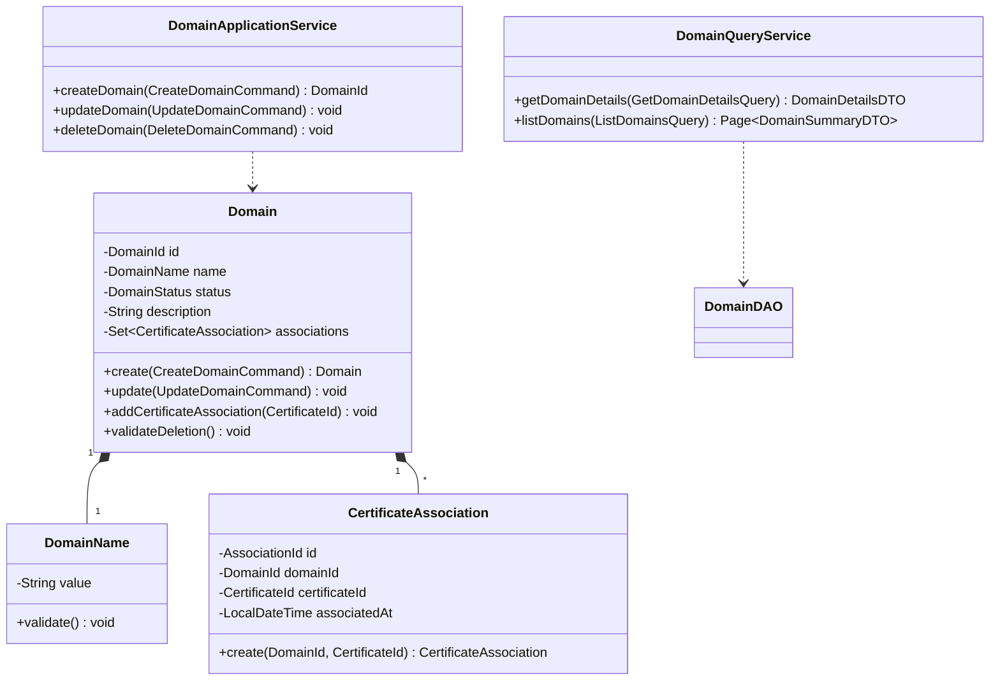
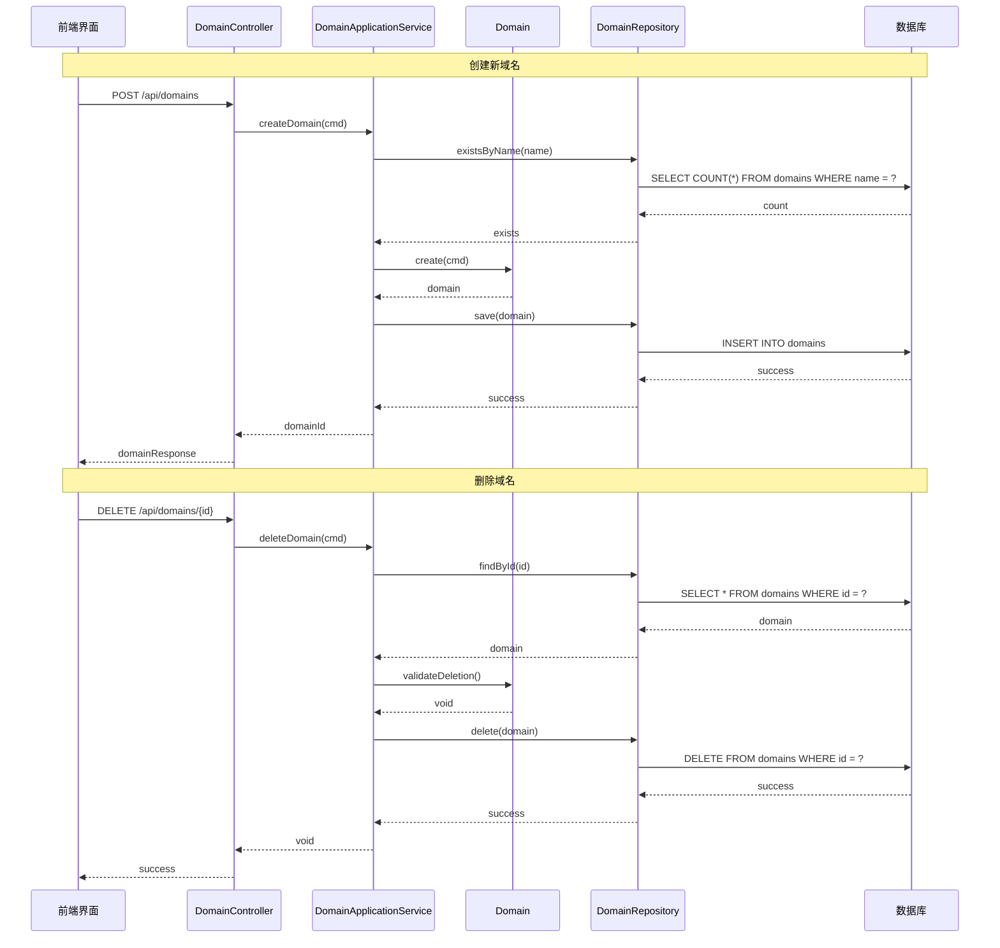

# 限界上下文战术设计 - 域名管理上下文 (Domain Context)

## **1. 上下文概述与通用语言 (Context Overview & Ubiquitous Language)**

### **1.1 战略承接 (Strategic Alignment)**

- **承载的子域**: 支撑域：域名管理
- **子域类型**: 支撑域
- **核心战略职责**:

    > 管理证书关联的域名信息，为证书管理提供基础支持，维护域名的生命周期和状态。

- **上下文边界 (Context Boundary)**:
    > 本上下文**不负责**以下业务：
    >
    > - 证书的生命周期管理（由证书上下文负责）
    > - 用户身份认证与权限管理（由认证授权上下文负责）
    > - 操作日志的存储和查询（由审计日志上下文负责）

### **1.2 通用语言 (Ubiquitous Language)**

| 术语 (Term)                | 在本上下文中的精确定义                        | 备注/反模式警告                                  |
| :------------------------- | :-------------------------------------------- | :----------------------------------------------- |
| **域名 (Domain)**          | 符合DNS规范的网络标识符，是证书管理的基础单位 | **警告**: 避免在`Domain`中包含证书相关的业务逻辑 |
| **域名状态 (Status)**      | 域名的当前状态，如有效、过期等                | 状态会影响域名是否可以关联新证书                 |
| **证书关联 (Association)** | 域名与证书之间的绑定关系                      | 一个域名可以关联多个证书                         |

## **2. 需求映射：从用户故事到用例 (Requirement Mapping: User Stories to Use Cases)**

| 用户故事ID | 故事标题         | 关联的应用层操作                                  | 触发的主要领域事件 |
| :--------- | :--------------- | :------------------------------------------------ | :----------------- |
| `CERT-001` | 管理员添加域名   | **用例**: `DomainApplicationService.createDomain` | `DomainCreated`    |
| `CERT-001` | 管理员修改域名   | **用例**: `DomainApplicationService.updateDomain` | `DomainUpdated`    |
| `CERT-001` | 管理员删除域名   | **用例**: `DomainApplicationService.deleteDomain` | `DomainDeleted`    |
| `CERT-004` | 外部系统查询域名 | **查询**: `DomainQueryService.getDomainDetails`   | (无)               |

## **3. 全局技术规约 (Global Technical Specifications)**

### **3.1 错误处理规约**:

```java
public class DomainException extends RuntimeException {
    private final ErrorCode errorCode;

    public enum ErrorCode {
        DOMAIN_NOT_FOUND,
        DOMAIN_ALREADY_EXISTS,
        VALIDATION_FAILED,
        DOMAIN_HAS_CERTIFICATES,
        SYSTEM_ERROR
    }
}
```

### **3.2 代码组织结构约定**

```
domain/
├── application/
│   ├── command/
│   │   ├── CreateDomainCommand.java
│   │   ├── UpdateDomainCommand.java
│   │   └── DeleteDomainCommand.java
│   ├── query/
│   │   ├── GetDomainDetailsQuery.java
│   │   └── ListDomainsQuery.java
│   └── service/
│       └── DomainApplicationService.java
├── domain/
│   ├── model/
│   │   ├── domain/
│   │   │   ├── Domain.java
│   │   │   ├── DomainId.java
│   │   │   ├── DomainStatus.java
│   │   │   └── DomainName.java
│   │   └── association/
│   │       ├── CertificateAssociation.java
│   │       └── AssociationId.java
│   ├── repository/
│   │   └── DomainRepository.java
│   └── service/
│       └── DomainService.java
└── infrastructure/
    ├── persistence/
    │   ├── MybatisDomainRepository.java
    │   └── entity/
    └── external/
```

## **4. 领域层设计 (Domain Layer Design)**

### **4.1 聚合: `域名 (Domain)`**

```java
@Aggregate
public class Domain {
    @AggregateId
    private DomainId id;
    private DomainName name;
    private DomainStatus status;
    private String description;
    private LocalDateTime createdAt;
    private LocalDateTime updatedAt;
    private Set<CertificateAssociation> certificateAssociations;

    // 工厂方法
    public static Domain create(CreateDomainCommand cmd) {
        validateDomainName(cmd.getName());
        Domain domain = new Domain();
        domain.id = DomainId.generate();
        domain.name = new DomainName(cmd.getName());
        domain.status = DomainStatus.ACTIVE;
        domain.description = cmd.getDescription();
        domain.createdAt = LocalDateTime.now();
        domain.updatedAt = domain.createdAt;
        domain.certificateAssociations = new HashSet<>();

        // 发布事件
        domain.registerEvent(new DomainCreatedEvent(domain.id));
        return domain;
    }

    // 更新域名信息
    public void update(UpdateDomainCommand cmd) {
        if (cmd.getDescription() != null) {
            this.description = cmd.getDescription();
        }
        this.updatedAt = LocalDateTime.now();

        // 发布事件
        this.registerEvent(new DomainUpdatedEvent(this.id));
    }

    // 添加证书关联
    public void addCertificateAssociation(CertificateId certificateId) {
        validateCertificateAssociation(certificateId);
        CertificateAssociation association = CertificateAssociation.create(this.id, certificateId);
        this.certificateAssociations.add(association);

        // 发布事件
        this.registerEvent(new CertificateAssociatedEvent(this.id, certificateId));
    }

    // 删除前验证
    public void validateDeletion() {
        if (!this.certificateAssociations.isEmpty()) {
            throw new DomainException(ErrorCode.DOMAIN_HAS_CERTIFICATES);
        }
    }
}
```

#### **4.1.1 值对象: `DomainName`**

```java
@Value
public class DomainName {
    private final String value;

    public DomainName(String value) {
        validateDomainNameFormat(value);
        this.value = value.toLowerCase();
    }

    private void validateDomainNameFormat(String value) {
        if (!isDomainNameValid(value)) {
            throw new DomainException(ErrorCode.VALIDATION_FAILED);
        }
    }

    private boolean isDomainNameValid(String value) {
        return value != null && value.matches("^[a-zA-Z0-9][-a-zA-Z0-9]*[a-zA-Z0-9]\\.[a-zA-Z0-9-.]+$");
    }
}
```

#### **4.1.2 实体: `CertificateAssociation`**

```java
@Entity
public class CertificateAssociation {
    private AssociationId id;
    private DomainId domainId;
    private CertificateId certificateId;
    private LocalDateTime associatedAt;

    public static CertificateAssociation create(DomainId domainId, CertificateId certificateId) {
        CertificateAssociation association = new CertificateAssociation();
        association.id = AssociationId.generate();
        association.domainId = domainId;
        association.certificateId = certificateId;
        association.associatedAt = LocalDateTime.now();
        return association;
    }
}
```

## **5. 应用层设计 (Application Layer Design)**

### **5.1 应用服务: `DomainApplicationService`**

```java
@ApplicationService
public class DomainApplicationService {
    private final DomainRepository domainRepository;
    private final EventPublisher eventPublisher;

    @Transactional
    public DomainId createDomain(CreateDomainCommand cmd) {
        // 检查域名是否已存在
        if (domainRepository.existsByName(cmd.getName())) {
            throw new DomainException(ErrorCode.DOMAIN_ALREADY_EXISTS);
        }

        // 创建域名
        Domain domain = Domain.create(cmd);

        // 保存并发布事件
        domainRepository.save(domain);
        eventPublisher.publish(domain.getDomainEvents());

        return domain.getId();
    }

    @Transactional
    public void updateDomain(UpdateDomainCommand cmd) {
        Domain domain = domainRepository.findById(cmd.getDomainId())
            .orElseThrow(() -> new DomainException(ErrorCode.DOMAIN_NOT_FOUND));

        domain.update(cmd);

        domainRepository.save(domain);
        eventPublisher.publish(domain.getDomainEvents());
    }

    @Transactional
    public void deleteDomain(DeleteDomainCommand cmd) {
        Domain domain = domainRepository.findById(cmd.getDomainId())
            .orElseThrow(() -> new DomainException(ErrorCode.DOMAIN_NOT_FOUND));

        domain.validateDeletion();

        domainRepository.delete(domain);
        eventPublisher.publish(new DomainDeletedEvent(domain.getId()));
    }
}
```

### **5.2 查询服务: `DomainQueryService`**

```java
@QueryService
public class DomainQueryService {
    private final DomainDAO domainDAO;

    public DomainDetailsDTO getDomainDetails(GetDomainDetailsQuery query) {
        return domainDAO.findDetailsByDomainId(query.getDomainId())
            .orElseThrow(() -> new DomainException(ErrorCode.DOMAIN_NOT_FOUND));
    }

    public Page<DomainSummaryDTO> listDomains(ListDomainsQuery query) {
        return domainDAO.findAll(
            query.getFilter(),
            PageRequest.of(query.getPage(), query.getPageSize())
        );
    }
}
```

## **6. 基础设施层设计 (Infrastructure Layer Design)**

### **6.1 仓储实现: `MybatisDomainRepository`**

```java
@Repository
public class MybatisDomainRepository implements DomainRepository {
    @Autowired
    private DomainMapper domainMapper;

    @Override
    public void save(Domain domain) {
        if (domain.isNew()) {
            domainMapper.insert(domain);
        } else {
            domainMapper.update(domain);
        }
    }

    @Override
    public Optional<Domain> findById(DomainId id) {
        return Optional.ofNullable(domainMapper.findById(id.getValue()));
    }

    @Override
    public boolean existsByName(String name) {
        return domainMapper.countByName(name) > 0;
    }
}
```

### **6.2 查询DAO: `DomainDAO`**

```java
@Repository
public class DomainDAO {
    @Autowired
    private DomainMapper domainMapper;

    public Optional<DomainDetailsDTO> findDetailsByDomainId(DomainId id) {
        return Optional.ofNullable(domainMapper.findDetailsById(id.getValue()));
    }

    public Page<DomainSummaryDTO> findAll(DomainFilter filter, PageRequest pageRequest) {
        long total = domainMapper.countByFilter(filter);
        List<DomainSummaryDTO> items = domainMapper.findByFilter(filter, pageRequest);
        return new PageImpl<>(items, pageRequest, total);
    }
}
```

## **7. API设计**

### OpenAPI 3.0 规范

```yaml
openapi: 3.0.0
info:
    title: Domain Management API
    version: 1.0.0
paths:
    /api/domains:
        post:
            summary: Create a new domain
            requestBody:
                content:
                    application/json:
                        schema:
                            $ref: "#/components/schemas/CreateDomainRequest"
            responses:
                "201":
                    description: Domain created successfully
                    content:
                        application/json:
                            schema:
                                $ref: "#/components/schemas/DomainResponse"
        get:
            summary: List all domains
            parameters:
                - name: page
                  in: query
                  schema:
                      type: integer
                - name: size
                  in: query
                  schema:
                      type: integer
            responses:
                "200":
                    description: List of domains
                    content:
                        application/json:
                            schema:
                                $ref: "#/components/schemas/DomainPageResponse"
components:
    schemas:
        CreateDomainRequest:
            type: object
            properties:
                name:
                    type: string
                description:
                    type: string
        DomainResponse:
            type: object
            properties:
                id:
                    type: string
                name:
                    type: string
                status:
                    type: string
                description:
                    type: string
```

## **8. 类图**



## **9. 时序图**



## **10. 测试策略**

### **10.1 单元测试**

```java
class DomainTest {
    @Test
    void shouldCreateValidDomain() {
        // Given
        CreateDomainCommand cmd = createValidCommand();

        // When
        Domain domain = Domain.create(cmd);

        // Then
        assertThat(domain.getStatus()).isEqualTo(DomainStatus.ACTIVE);
        assertThat(domain.getDomainEvents())
            .hasSize(1)
            .hasOnlyElementsOfType(DomainCreatedEvent.class);
    }

    @Test
    void shouldNotDeleteDomainWithCertificates() {
        // Given
        Domain domain = createDomainWithCertificates();

        // When/Then
        assertThrows(DomainException.class,
            () -> domain.validateDeletion());
    }
}
```

### **10.2 集成测试**

```java
@SpringBootTest
class DomainApplicationServiceTest {
    @Autowired
    private DomainApplicationService service;

    @Test
    void shouldCreateAndUpdateDomain() {
        // Given
        CreateDomainCommand createCmd = createValidCommand();

        // When
        DomainId id = service.createDomain(createCmd);
        UpdateDomainCommand updateCmd = new UpdateDomainCommand(id, "Updated description");
        service.updateDomain(updateCmd);

        // Then
        DomainDetailsDTO details = service.getDomainDetails(id);
        assertThat(details.getDescription()).isEqualTo("Updated description");
    }
}
```

## **11. 待决策项与风险**

### 待决策项

1. **域名验证机制**

    - **问题**: 是否需要实现域名所有权验证
    - **选项A**: 通过DNS记录验证
    - **选项B**: 通过文件验证
    - **建议**: 初期实现DNS记录验证，后续可以支持多种验证方式

2. **域名分级管理**
    - **问题**: 是否需要支持域名的分级管理（主域名和子域名）
    - **选项A**: 扁平化管理
    - **选项B**: 树形结构管理
    - **建议**: 初期采用扁平化管理，后续根据需求扩展

### 风险项

1. **数据一致性风险**

    - **描述**: 域名和证书关联关系的一致性维护
    - **影响**: 可能导致孤立数据或不一致状态
    - **缓解措施**:
        - 实现强一致性的事务处理
        - 定期数据一致性检查
        - 实现数据修复机制

2. **性能风险**
    - **描述**: 域名查询和关联查询的性能
    - **影响**: 可能影响系统响应时间
    - **缓解措施**:
        - 实现高效的索引策略
        - 使用缓存机制
        - 实现分页查询
