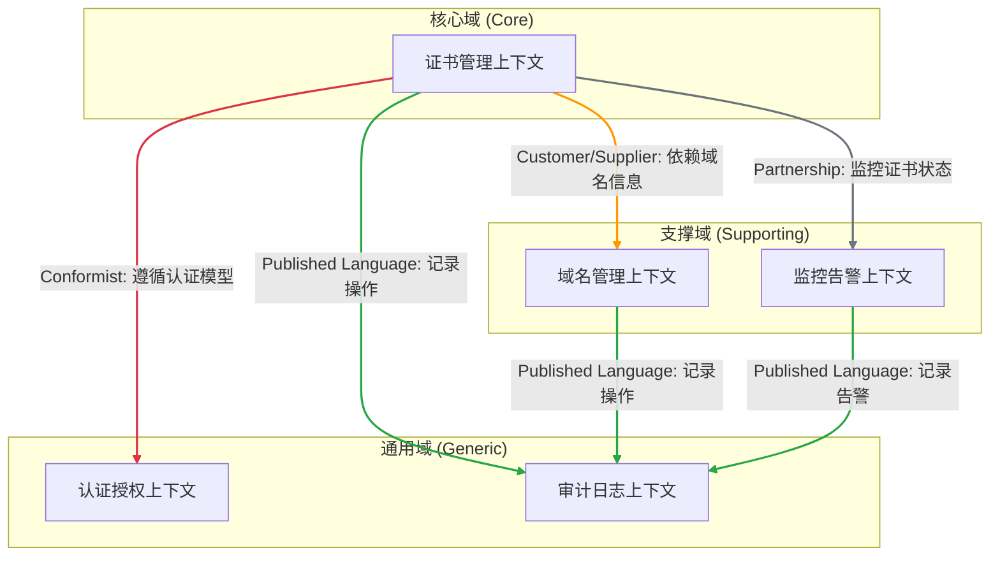
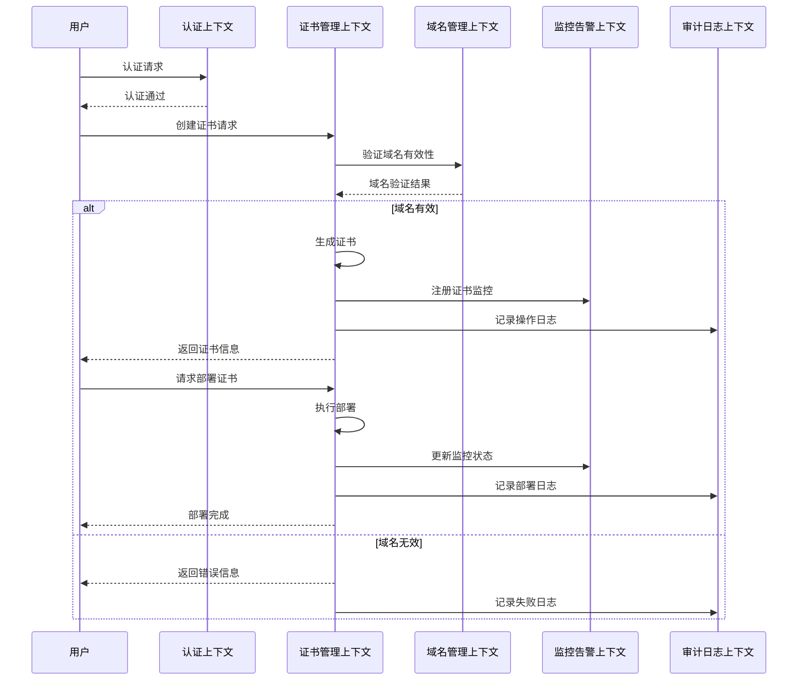

# 领域驱动战略设计 - 证书管理系统 (Certificate Management System)

## **1. 战略目标与商业背景 (The "Why")**

### **1.1 业务愿景 (Business Vision)**

打造一个安全可靠的证书管理平台，为企业提供完整的数字证书生命周期管理，确保系统间通信的安全性和可信度，支持业务持续稳定运行。

### **1.2 要解决的核心业务问题 (Core Problem to Solve)**

当前企业在数字证书管理方面面临以下挑战：

- 证书分散管理，缺乏统一的管理平台
- 证书过期容易被忽视，造成系统通信中断
- 证书部署和更新流程繁琐，容易出错
- 缺乏对证书全生命周期的有效管理和监控

### **1.3 关键业务目标/指标 (Key Business Goals / OKRs)**

- **目标1:** 提供统一的证书管理平台，实现证书的集中化管理
- **目标2:** 确保所有证书都在有效期内，避免因证书过期导致的系统中断
- **目标3:** 简化证书部署和更新流程，提高运维效率
- **目标4:** 实现证书全生命周期的可视化管理和监控

### **1.4 主要限制与假设 (Major Constraints & Assumptions)**

- **技术栈:** 基于云原生架构，支持容器化部署
- **安全要求:** 必须符合行业安全标准，支持细粒度的权限控制
- **可用性:** 系统需要保持高可用，支持证书的快速部署和回滚
- **兼容性:** 需要支持多种证书格式和密钥类型

## **2. 问题空间分析：子域划分 (The "What" - Problem Space)**

### 2.1. 核心域 (Core Domain)

- **子域名称**: 证书生命周期管理
- **职责描述**: 负责证书的创建、更新、部署、撤销等核心操作，是整个系统的核心竞争力
- **战略重要性**: **极高**。直接影响系统的安全性和可用性，是业务持续运行的关键保障

### 2.2. 支撑域 (Supporting Subdomain)

- **子域名称**: 域名管理
- **职责描述**: 管理证书关联的域名信息，为证书管理提供基础支持
- **战略重要性**: **中等**。虽非核心竞争力，但对证书管理至关重要

- **子域名称**: 证书监控告警
- **职责描述**: 监控证书状态，在证书即将过期或出现异常时发出告警
- **战略重要性**: **中等**。确保证书的有效性和系统的稳定运行

### 2.3. 通用域 (Generic Subdomain)

- **子域名称**: 用户认证授权
- **职责描述**: 处理用户登录、权限验证等基础功能
- **战略重要性**: **低**。可使用成熟的认证授权解决方案

- **子域名称**: 审计日志
- **职责描述**: 记录系统操作日志，支持追溯和合规
- **战略重要性**: **低**。可采用标准的日志解决方案

## **3. 解决方案蓝图：上下文映射 (The "How It Connects")**

### **3.1 限界上下文总览**

| 限界上下文 (Bounded Context)     | 承载的主要子域               | 实现建议 (微服务/模块/...) |
| :------------------------------- | :--------------------------- | :------------------------- |
| **证书管理上下文 (Certificate)** | **核心域**: 证书生命周期管理 | 微服务                     |
| **域名管理上下文 (Domain)**      | **支撑域**: 域名管理         | 微服务                     |
| **监控告警上下文 (Monitor)**     | **支撑域**: 证书监控告警     | 微服务                     |
| **认证授权上下文 (Auth)**        | **通用域**: 用户认证授权     | 集成开源解决方案           |
| **审计日志上下文 (Audit)**       | **通用域**: 审计日志         | 集成日志服务               |

### **3.2 上下文关系图 (Visual Map)**

### **3.3 关系定义与集成策略**

| 上游上下文 (Upstream) | 下游上下文 (Downstream) | 关系模式 (Pattern) | 理由与说明 (Rationale & Description)                                             |
| :-------------------- | :---------------------- | :----------------- | :------------------------------------------------------------------------------- |
| **域名管理上下文**    | **证书管理上下文**      | **客户-供应商**    | 证书管理需要域名信息作为基础数据，域名管理上下文需要提供稳定的接口供证书管理使用 |
| **证书管理上下文**    | **监控告警上下文**      | **合作关系**       | 双方紧密协作，监控上下文需要证书状态信息，证书管理上下文需要接收告警反馈         |
| **认证授权上下文**    | **所有其他上下文**      | **遵奉者**         | 统一的认证授权机制，其他上下文需要遵循其认证模型和接口规范                       |
| **所有上下文**        | **审计日志上下文**      | **发布语言**       | 统一的日志记录格式，确保审计追踪的一致性                                         |

## **4. 解决方案详述：限界上下文设计 (The "How" - Solution Space)**

### **4.1 限界上下文: 证书管理上下文 (Certificate Context)**

- **关联子域**: 核心域 - 证书生命周期管理
- **核心职责**: 管理证书的完整生命周期，包括创建、更新、部署、撤销等操作
- **核心业务规则/不变量**:

    - 证书必须关联到有效的域名
    - 证书必须在有效期内才能部署
    - 证书更新不能影响当前运行的系统
    - 敏感操作必须有相应的权限

- **关键业务概念**:

    - 证书 (Certificate)
    - 证书状态 (CertificateStatus)
    - 部署配置 (DeploymentConfig)

- **通用语言**:
  | 术语 (Term) | 在本上下文中的精确定义 | 备注/示例 |
  | :--- | :--- | :--- |
  | **证书** | 包含公钥、私钥、域名信息的数字证书 | 如SSL证书 |
  | **部署** | 将证书应用到指定系统的过程 | 包括上架、下架操作 |

- **对外暴露的关键能力**:

    - `createCertificate()`
    - `deployCertificate()`
    - `revokeCertificate()`
    - `checkCertificateStatus()`

- **技术实现建议**: 独立的微服务，支持高可用部署

### **4.2 限界上下文: 域名管理上下文 (Domain Context)**

- **关联子域**: 支撑域 - 域名管理
- **核心职责**: 管理域名信息，维护域名与证书的关联关系
- **核心业务规则/不变量**:

    - 域名必须是唯一的
    - 域名必须符合DNS规范
    - 域名删除前必须检查证书关联

- **关键业务概念**:

    - 域名 (Domain)
    - 域名状态 (DomainStatus)
    - 证书关联 (CertificateAssociation)

- **通用语言**:
  | 术语 (Term) | 在本上下文中的精确定义 | 备注/示例 |
  | :--- | :--- | :--- |
  | **域名** | 符合DNS规范的网络标识符 | 如example.com |
  | **关联证书** | 与域名绑定的有效证书列表 | 包括主域名和子域名证书 |

- **对外暴露的关键能力**:

    - `addDomain()`
    - `updateDomain()`
    - `deleteDomain()`
    - `listCertificates()`

- **技术实现建议**: 独立的微服务

## **5. 关键业务流程 (Key Business Process)**

### 场景：证书创建和部署流程

## **6. 待决策项与风险 (Open Questions & Risks)**

### 待决策项

1. **证书存储方案**

    - **问题**: 证书私钥等敏感信息的存储方案选择
    - **选项A**: 使用专用的密钥管理系统（如HashiCorp Vault）
    - **选项B**: 自建加密存储系统
    - **建议**: 使用成熟的密钥管理系统，降低安全风险

2. **证书自动续期**
    - **问题**: 是否支持证书自动续期功能
    - **选项A**: 完全自动化续期
    - **选项B**: 半自动化（需人工确认）
    - **建议**: 初期采用半自动化方案，待系统稳定后逐步实现完全自动化

### 风险项

1. **安全风险**

    - **描述**: 证书私钥泄露风险
    - **影响**: 可能导致系统安全性受损
    - **缓解措施**:
        - 实施严格的访问控制
        - 所有操作需要多重认证
        - 定期安全审计

2. **可用性风险**
    - **描述**: 证书部署失败或更新不及时导致系统中断
    - **影响**: 业务服务不可用
    - **缓解措施**:
        - 实现证书部署的自动回滚机制
        - 建立完善的监控告警体系
        - 保持证书备份
