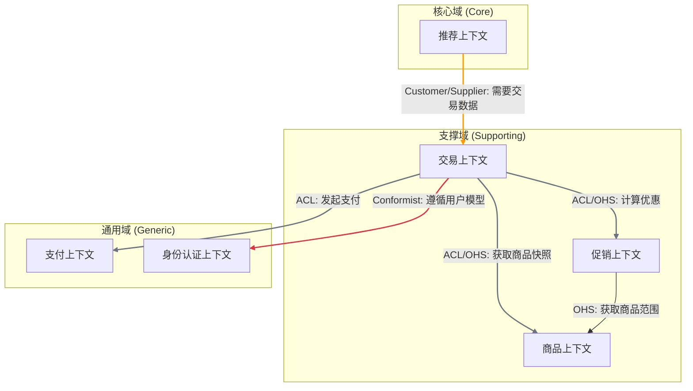
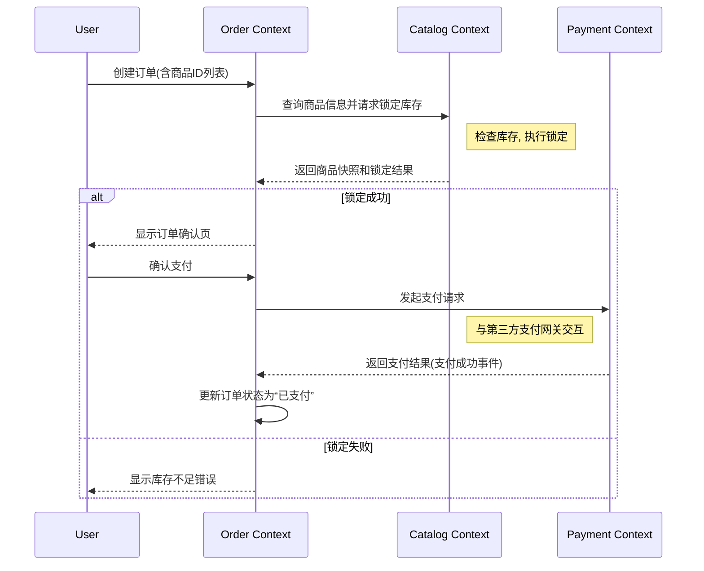

---
description:
globs:
alwaysApply: false
---

# 领域驱动战略设计战略设计 - [根据产品需求生成项目/产品名称]

## **1. 战略目标与商业背景 (The "Why")**

_AI指令：本章节是所有后续设计的基础。请与业务方确认，并用清晰、无歧义的语言描述。这是你的核心输入。_

### **1.1 业务愿景 (Business Vision)**

> _简要描述项目的最终理想状态，它要为世界或客户带来什么独特的价值。_ > **示例：** 打造一个高度个性化的购物平台，让每位用户都能发现并买到最适合自己的商品，从而将“搜索”转变为“发现”的乐趣。

### **1.2 要解决的核心业务问题 (Core Problem to Solve)**

> _以用户故事或问题陈述的形式，明确我们要解决的痛点。_ > **示例：** 当前电商平台同质化严重，用户需要花费大量时间在海量商品中进行低效筛选，导致转化率低和用户流失。

### **1.3 关键业务目标/指标 (Key Business Goals / OKRs)**

> _列出可量化的成功标准。这将是评估架构优劣的最终标尺。_
>
> - **目标1:** 提升用户转化率 `[例如：从3%提升至5%]`。
> - **目标2:** 提高用户复购率 `[例如：季度复购率提升20%]`。
> - **目标3:** 缩短新促销活动的上线时间 `[例如：从2周缩短至3天]`。

### **1.4 主要限制与假设 (Major Constraints & Assumptions)**

> _列出现实的约束条件，这决定了设计的边界。_
>
> - **技术栈:** `[例如：必须基于云原生架构，优先使用Java/Go]`
> - **外部依赖:** `[例如：支付必须对接XX银行的旧版接口]`

---

## **2. 问题空间分析：子域划分 (The "What" - Problem Space)**

_AI指令：基于第1章的业务目标，分析构成业务版图的各个部分，并对其战略重要性进行分类。请识别业务中的不同部分，并按其战略价值进行分类。这决定了我们应该在何处投入最多的精力和最优秀的设计。_

## 2.1. 核心域 (Core Domain)

> 业务成功的关键，是企业的核心竞争力所在。必须投入最大资源，进行精细化建模和定制开发。

- **子域名称**: `[核心域的名称，例如：智能匹配与推荐子域]`
- **职责描述**: `[描述该子域的核心业务能力。例如：基于用户行为、书籍属性和市场热度，为买家精准推荐书籍，为卖家推荐潜在买家。]`
- **战略重要性**: **极高**。这是我们与其他竞争对手拉开差距的关键，是吸引和留存用户的核心引擎。

## 2.2. 支撑域 (Supporting Subdomain)

> 业务必需，但非核心竞争力。通常为核心域服务，需要定制开发，但可以采用相对简单的模型。

- **子域名称**: `[支撑域的名称，例如：订单与交易管理子域]`
- **职责描述**: `[描述该子域的业务能力。例如：处理从下单、支付确认、到交易完成的整个流程管理，包括订单状态跟踪和退款处理。]`
- **战略重要性**: **中等**。虽然交易流程必须可靠，但其实现方式并非我们的差异化优势。应确保其稳定高效，但不需过度设计。

- **(可以有多个支撑域，按需添加)**

## 2.3. 通用域 (Generic Subdomain)

> 业界已有成熟解决方案，非业务独有。应优先考虑购买或使用开源方案，避免重复造轮子。

- **子域名称**: `[通用域的名称，例如：用户身份认证子域]`
- **职责描述**: `[描述该子域的通用能力。例如：负责用户的注册、登录、密码管理和第三方账号（如微信）授权登录。]`
- **战略重要性**: **低**。这是行业标准功能，我们不应在此投入研发资源。建议集成现成的身份认证服务（如 Auth0）或成熟的开源库。

- **(可以有多个通用域，按需添加)**

---

## **3. 解决方案蓝图：上下文映射 (The "How It Connects")**

_AI指令：在深入细节之前，先展示软件的整体结构和交互关系。这幅“地图”是后续详细设计的向导。_

### **3.1 限界上下文总览**

> _下表将“问题空间”的子域映射到“解决方案空间”的限界上下文。_

| 限界上下文 (Bounded Context)    | 承载的主要子域             | 实现建议 (微服务/模块/...) |
| :------------------------------ | :------------------------- | :------------------------- |
| **推荐上下文 (Recommendation)** | **核心域**: 智能匹配与推荐 | 微服务                     |
| **交易上下文 (Trading)**        | **支撑域**: 订单与交易管理 | 微服务                     |
| **促销上下文 (Promotion)**      | **支撑域**: 订单与交易管理 | 微服务                     |
| **商品上下文 (Catalog)**        | **支撑域**: 商品管理       | 微服务                     |
| **身份认证上下文 (Identity)**   | **通用域**: 用户身份认证   | 外部SaaS/开源方案          |
| **支付上下文 (Payment)**        | **通用域**: 支付集成       | 微服务 (主要作为网关)      |

### **3.2 上下文关系图 (Visual Map)**

### **3.3 关系定义与集成策略**

| 上游上下文 (Upstream)         | 下游上下文 (Downstream)         | 关系模式 (Pattern)                  | 理由与说明 (Rationale & Description)                                                                                                                                |
| :---------------------------- | :------------------------------ | :---------------------------------- | :------------------------------------------------------------------------------------------------------------------------------------------------------------------ |
| **商品上下文 (Catalog)**      | **交易上下文 (Trading)**        | **防腐层(ACL) + 开放主机服务(OHS)** | 交易时需要商品信息，但只关心价格、SKU、名称等稳定快照信息。交易上下文通过ACL调用商品上下文的OHS接口，避免商品侧复杂的属性变更（如富文本描述）影响交易核心的稳定性。 |
| **促销上下文 (Promotion)**    | **交易上下文 (Trading)**        | **防腐层(ACL) + 开放主机服务(OHS)** | 交易是核心流程，必须保护。促销逻辑复杂且易变。促销上下文通过OHS提供稳定的优惠计算接口，交易上下文通过ACL调用，防止促销逻辑污染交易核心。                            |
| **身份认证上下文 (Identity)** | **交易上下文 (Trading)**        | **遵奉者 (Conformist)**             | 认证是全公司统一的权威服务，交易上下文没有必要也没有能力去定义用户模型。完全遵从认证上下文的接口和模型是最经济的选择。                                              |
| **交易上下文 (Trading)**      | **推荐上下文 (Recommendation)** | **客户-供应商 (Customer-Supplier)** | 推荐上下文（供应商）需要交易数据（客户的购买行为）来优化模型。交易上下文（客户）有权要求推荐上下文（供应商）提供稳定的数据消费接口和SLA，确保数据管道的质量。       |

---

## **4. 解决方案详述：限界上下文设计 (The "How" - Solution Space)**

_AI指令：基于第2章的子域划分，设计具体的软件边界——限界上下文。为每个上下文提供独立的分析。这是将宏观战略落地为微观架构的关键一步。_

### **4.1 限界上下文: `交易上下文 (Trading Context)`**

- **关联子域**: `[此上下文主要服务于哪个子域？例如：核心域]`
- **核心职责:** 负责从用户购物车结算开始，到最终生成有效订单为止的整个生命周期。
- **核心业务规则/不变量**:
    > **引导说明**: 用自然语言描述此上下文必须强制执行的核心业务约束。
    - `规则1：每个商品（Listing）必须关联一个有效的卖家用户。`
    - `规则2：商品的价格不能为负数。`
    - `规则3：库存为零的商品不能被搜索到。`
- **关键业务概念**:
    > **引导说明**: 列出此上下文中最核心的名词，它们是未来战术设计中聚合根的强有力候选者。
    - `商品 (Listing)`
    - `图书元数据 (Book Metadata)`
- **通用语言:**
  | 术语 (Term) | 在本上下文中的精确定义 | 备注/示例 |
  | :--- | :--- | :--- |
  | **订单 (Order)** | 一次交易的快照，包含商品、价格、收货人、支付状态等信息。创建后不可轻易变更。 | 区别于“购物车”这种易变状态。 |
  | **交易资格 (Trade Eligibility)** | 用户在下单前必须满足的一系列校验规则，如库存充足、商品可售。 | 这是下单前的关键一步。 |
- **对外暴露的关键能力:** `创建订单()`, `查询订单详情()`, `取消订单()`。
- **技术实现建议:** 微服务。

### **4.2 限界上下文: `促销上下文 (Promotion Context)`**

- **关联子域**: `[例如：支撑域]`
- **核心职责:** 定义、计算和应用各类促销规则，为交易提供优惠信息。
- **核心业务规则/不变量**:
    - `规则1：订单的总价必须等于所有订单项价格之和。`
    - `规则2：一旦订单被支付，其包含的商品列表和价格不能再被修改。`
    - `规则3：只有处于“待支付”状态的订单才能被取消。`
- **关键业务概念**:
    - `订单 (Order)`
- **通用语言:**
  | 术语 (Term) | 在本上下文中的精确定义 | 备注/示例 |
  | :--- | :--- | :--- |
  | **优惠券 (Coupon)** | 一种可用于抵扣订单金额的数字凭证，有明确的作用范围和生命周期。 | |
  | **活动规则 (Rule)** | 定义一个促销活动如何生效的逻辑集合，例如“满200减20”。 | 规则引擎是这里的核心。 |
- **对外暴露的关键能力:** `获取商品可用优惠()`, `计算订单优惠明细()`。
- **技术实现建议:** 微服务 (包含一个独立的规则引擎)。

### **4.3 限界上下文: `推荐上下文 (Recommendation Context)`**

- **关联子域**: `[例如：通用域]`
- **核心职责:** 根据用户行为和偏好，生成个性化的商品推荐列表。
- **核心业务规则/不变量**:
    - `规则1：订单的总价必须等于所有订单项价格之和。`
    - `规则2：一旦订单被支付，其包含的商品列表和价格不能再被修改。`
    - `规则3：只有处于“待支付”状态的订单才能被取消。`
- **关键业务概念**:
    - `订单 (Order)`
- **通用语言:** ... (以此类推)
- ... (以此类推)

_... (根据需要，为其他子域设计上下文) ..._

---

## **5. 关键业务流程 (Key Business Process)**

_AI指令：使用序列图展示一个关键业务流程如何跨越多个限界上下文来完成，以验证架构的协作性。_

### 场景：用户下单流程

---

## **6. 待决策项与风险 (Open Questions & Risks)**

_AI指令：暴露你设计中的不确定性，或需要人类专家决策的地方。这体现了你的可靠性。_

- **待决策1:** **库存管理拆分。** 当前“商品上下文”管理了库存。如果未来业务涉及多仓库、分仓、库存预占等复杂逻辑，是否需要将其拆分为独立的“库存上下文”？

    - **选项A:** 保持现状，快速实现。
    - **选项B:** 预先拆分，增加初期复杂度但未来扩展性更好。
    - **建议:** 初期保持合并，但商品上下文内部做好模块化隔离，为未来拆分预留接口。

- **风险1:** **外部支付接口。** 对接的XX银行旧版接口不稳定且文档不全。

    - **缓解措施:** 需要为“支付上下文”设计更强大的防腐层，包含完整的日志、监控、熔断和重试机制，并准备备用支付渠道。这将增加支付上下文约30%的开发工作量。

- **风险2:** **团队技能储备。** “推荐上下文”作为核心域，对算法工程师和能够驾驭复杂模型的后端工程师有较高要求。
    - **缓解措施:** 立即启动相关人员的招聘计划，并组织内部培训，同时初期可先采用相对简单的推荐策略（如热门推荐、协同过滤）快速上线，再逐步迭代复杂的模型。
